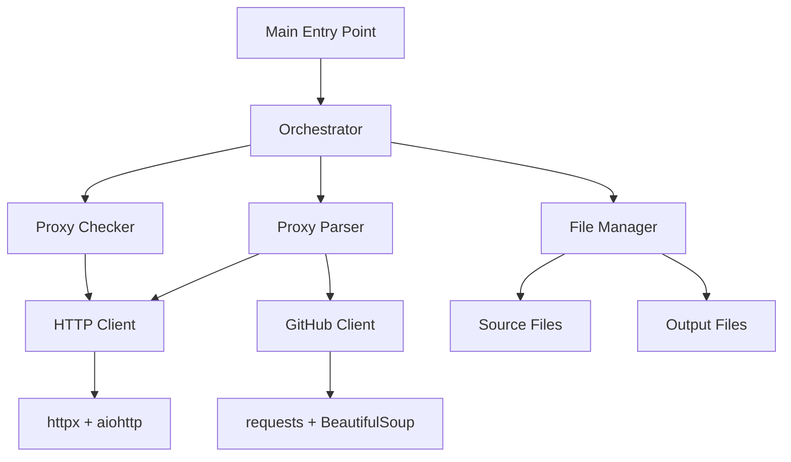

# Proxy Parser

A high-performance, asynchronous proxy scraper and validator that discovers free proxies from GitHub repositories and validates their functionality.

## 🚀 Features

- **🔄 Asynchronous Processing**: Built with `asyncio` for concurrent proxy checking and high throughput
- **🔍 GitHub Integration**: Automatically searches GitHub repositories for proxy lists using intelligent queries
- **✅ Real-time Validation**: Tests proxy functionality against external APIs to ensure they're working
- **📊 Multiple Proxy Types**: Supports HTTP, HTTPS, SOCKS4, and SOCKS5 proxies
- **⚙️ Highly Configurable**: Customizable timeouts, connection limits, and parsing depth
- **📝 Comprehensive Logging**: Detailed logging with `loguru` for monitoring and debugging
- **🛡️ Robust Error Handling**: Graceful handling of network errors and invalid proxies
- **🏗️ Modular Architecture**: Clean separation of concerns with dedicated modules

## 📋 Proxy Support

| Proxy Type | Support Status | Notes |
|------------|----------------|-------|
| HTTP       | ✅ Full Support | Native support via `httpx` and `aiohttp` |
| HTTPS      | ✅ Full Support | Native support via `httpx` and `aiohttp` |
| SOCKS5     | ✅ Full Support | Supported via `httpx[socks]` |
| SOCKS4     | ⚠️ Limited     | Supported via `aiohttp`, skipped in `httpx` validation |

## 🛠️ Installation

### Prerequisites
- Python 3.11 or higher
- pip or uv package manager

### Using uv (Recommended)
```bash
# Install uv if you haven't already
curl -LsSf https://astral.sh/uv/install.sh | sh

# Clone and install
git clone <repository-url>
cd proxyParser
uv sync --no-dev
```

### Using pip
```bash
git clone <repository-url>
cd proxyParser
pip install -r requirements.txt
```

## ⚙️ Configuration

Edit `config.ini` to customize behavior:

```ini
[General]
Timeout = 10                 # HTTP request timeout (seconds)
MaxConnections = 800         # Maximum concurrent connections
ProxyCheckTimeout = 5        # Proxy validation timeout (seconds)
SavePath = ./proxies         # Directory to save proxy files
MainTimeout = 600            # Seconds between parsing cycles
ParsingDepth = 7             # Number of GitHub pages to search
SESSION_COOKIES =            # Optional GitHub session cookies for enhanced access
```

### Configuration Parameters

| Parameter | Description | Default | Range |
|-----------|-------------|---------|-------|
| `Timeout` | HTTP request timeout in seconds | 10 | 1-60 |
| `MaxConnections` | Maximum concurrent connections | 800 | 100-2000 |
| `ProxyCheckTimeout` | Proxy validation timeout | 5 | 1-30 |
| `SavePath` | Output directory for proxy files | `./proxies` | Any valid path |
| `MainTimeout` | Delay between parsing cycles | 600 | 60-3600 |
| `ParsingDepth` | GitHub search pages to process | 7 | 1-20 |

## 🚀 Usage

### Run Continuous Mode (Default)
```bash
uv run python -m proxy_parser
```

This will continuously:
1. 🔍 Search GitHub for proxy files using various queries
2. 📄 Parse and extract proxy addresses from found sources
3. ✅ Validate each proxy for functionality
4. 💾 Save working proxies to `parsed.txt`
5. ⏱️ Wait for the configured timeout before repeating

### Run Single Cycle
```bash
uv run proxy_parser --single-cycle
```

### Command Line Options
```bash
uv run proxy_parser --help
```

Available options:
- `--single-cycle`: Run once and exit
- `--update-sources`: Only update source files
- `--parse-only`: Only parse proxies without validation
- `--check-only`: Only validate existing proxies
- `--timeout SECONDS`: Override main timeout
- `--verbose`: Enable verbose logging

## 📁 Project Structure

```
proxyParser/
├── proxy_parser/              # Main package
│   ├── __init__.py           # Package initialization
│   ├── __main__.py           # Entry point and main orchestration
│   ├── config.py             # Configuration management
│   ├── http_client.py        # HTTP client utilities (httpx + aiohttp)
│   ├── file_operations.py    # File I/O operations
│   ├── parsers.py            # Proxy parsing and source management
│   ├── checkers.py           # Proxy validation logic
│   └── orchestrator.py       # Workflow coordination
├── sources/                   # Source files for different proxy types
│   ├── http.txt              # HTTP proxy sources
│   ├── https.txt             # HTTPS proxy sources
│   ├── socks4.txt            # SOCKS4 proxy sources
│   └── socks5.txt            # SOCKS5 proxy sources
├── tests/                     # Test suite
│   ├── test_checkers.py      # Proxy validation tests
│   ├── test_parsers.py       # Parser logic tests
│   └── test_main.py          # Configuration tests
├── config.ini                # Configuration file
├── requirements.txt          # Python dependencies
├── pyproject.toml            # Project metadata and build config
└── README.md                 # This file
```

## 🏗️ Architecture

The application follows a modular, event-driven architecture:



### Core Components

- **🎭 Orchestrator**: Coordinates the entire workflow and manages execution cycles
- **📁 File Manager**: Handles all file I/O operations with error recovery
- **🔍 Proxy Parser**: Extracts proxy addresses from various sources and formats
- **✅ Proxy Checker**: Validates proxy functionality using external APIs
- **🌐 HTTP Clients**: Manages HTTP requests with proper error handling and retries

## 📊 Output Files

| File | Description | Format |
|------|-------------|--------|
| `unchecked_proxies.txt` | Raw proxies extracted from sources | `ip:port` (one per line) |
| `parsed.txt` | Validated, working proxies | `ip:port` (one per line) |

## 🧪 Development

### Running Tests
```bash
pytest tests/

# Run specific test file
pytest tests/test_checkers.py -v
```

### Code Quality Standards
- **Type Hints**: Full type annotation throughout the codebase
- **Error Handling**: Comprehensive exception handling with proper logging
- **Async Patterns**: Modern `async`/`await` patterns for concurrent operations
- **Logging**: Structured logging with `loguru` for debugging and monitoring
- **Testing**: Unit tests with `pytest` and `pytest-asyncio`

### Install development dependencies
```bash
uv sync --dev
```

## ⚠️ Important Notes

- **Continuous Mode**: The parser runs indefinitely by default. Use `Ctrl+C` to stop gracefully
- **Rate Limiting**: Respects GitHub's rate limits and implements proper delays
- **Proxy Validation**: Uses external APIs for validation - ensure internet connectivity
- **Resource Usage**: Monitor system resources when using high `MaxConnections` values

## 📦 Dependencies

### Core Dependencies
- **`httpx[socks]`**: Modern async HTTP client with SOCKS proxy support
- **`aiohttp`**: Alternative async HTTP client for enhanced proxy compatibility
- **`requests`**: Synchronous HTTP client for GitHub search operations
- **`beautifulsoup4`**: HTML parsing for GitHub search results
- **`lxml`**: Fast XML/HTML parser backend
- **`loguru`**: Enhanced logging with better formatting and features

### Development Dependencies
- **`pytest`**: Testing framework
- **`pytest-asyncio`**: Async testing support
- **`ruff`**: Fast Python linter

## 📄 License

This project is licensed under the MIT License - see the [LICENSE](LICENSE) file for details.

## 🤝 Contributing

1. Fork the repository
2. Create a feature branch (`git checkout -b feature/amazing-feature`)
3. Commit your changes (`git commit -m 'Add amazing feature'`)
4. Push to the branch (`git push origin feature/amazing-feature`)
5. Open a Pull Request

## 📞 Support

If you encounter any issues or have questions:

1. Check the [Issues](../../issues) page for existing solutions
2. Create a new issue with detailed information about your problem
3. Include logs, configuration, and system information

---

**⭐ Star this repository if you find it useful!**